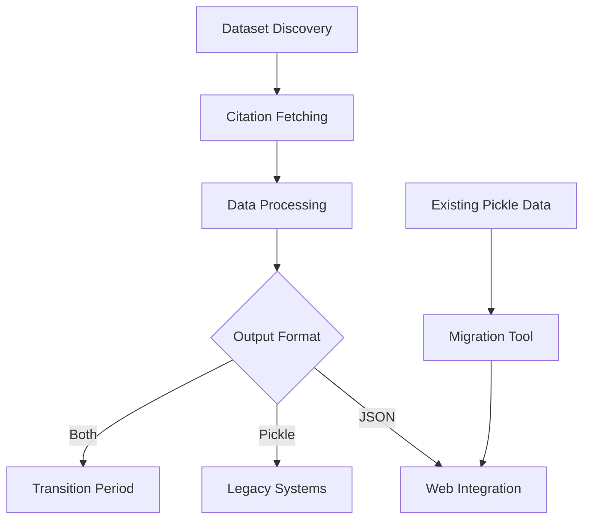

# NEMAR Citations

[](https://www.python.org/downloads/)
[](https://creativecommons.org/licenses/by-nc-sa/4.0/)
[](https://github.com/sccn/nemar-citations)

Automated BIDS dataset citation tracking and JSON generation system for scientific research datasets.

## Overview

This system automatically discovers, tracks, and manages citations for BIDS (Brain Imaging Data Structure) datasets. It provides a complete workflow from dataset discovery to citation tracking with web-friendly JSON output format, enhanced with AI-powered citation confidence scoring.

### Key Features

- **Automated Dataset Discovery**: Finds relevant BIDS datasets using configurable search patterns
- **Citation Tracking**: Fetches and tracks citation counts and detailed citation information from Google Scholar
- **Web-Ready Output**: Generates clean JSON files perfect for website integration
- **Format Migration**: Converts legacy pickle files to modern JSON format
- **CI/CD Integration**: GitHub Actions workflow for automated updates
- **Package Structure**: Professional Python package with CLI entry points
- **Citation Confidence Scoring**: AI-powered relevance scoring using sentence transformers
- **Dataset Metadata Retrieval**: Automated extraction of dataset descriptions and README files
- **Quality Assurance**: Type hints, comprehensive testing, and code quality standards

## Installation

### Requirements

- Python 3.8 or higher
- Active internet connection for citation fetching
- ScraperAPI key (for Google Scholar access)

### Install from Source

```bash
git clone https://github.com/sccn/nemar-citations.git
cd nemar-citations
pip install -e .
```

### Dependencies

The package automatically installs these core dependencies:
- `pandas>=1.3.0` - Data manipulation and analysis
- `scholarly>=1.7.0` - Google Scholar API interaction
- `requests>=2.25.0` - HTTP requests
- `beautifulsoup4>=4.9.0` - HTML parsing
- `free-proxy>=1.1.0` - Proxy management
- `python-dotenv>=0.19.0` - Environment variable management
- `sentence-transformers>=2.0.0` - AI-powered citation confidence scoring
- `PyGithub>=1.55.0` - GitHub API integration for metadata retrieval

## Quick Start

### 1. Environment Setup

Create a `.env` file in the project root:

```bash
SCRAPERAPI_KEY=your_scraperapi_key_here
```

### 2. Basic Usage

```bash
# Discover relevant datasets
dataset-citations-discover --output-file discovered_datasets.txt

# Update citations for discovered datasets
dataset-citations-update \
    --dataset-list-file discovered_datasets.txt \
    --previous-citations-file citations/previous_citations.csv \
    --output-dir citations/ \
    --output-format both

# Migrate existing pickle files to JSON
dataset-citations-migrate

# Retrieve dataset metadata for confidence scoring
dataset-citations-retrieve-metadata --citations-dir citations/json --output-dir datasets

# Calculate citation confidence scores
dataset-citations-score-confidence --citations-dir citations/json --datasets-dir datasets
```

### 3. Using as Python Package

```python
from dataset_citations.core import citation_utils
from dataset_citations.quality.confidence_scoring import CitationConfidenceScorer
from dataset_citations.quality.dataset_metadata import DatasetMetadataRetriever

# Convert pickle to JSON
json_path = citation_utils.migrate_pickle_to_json(
    'citations/pickle/ds002718.pkl', 
    'citations/json', 
    'ds002718'
)

# Load citation data
citations = citation_utils.load_citation_json(json_path)
print(f"Dataset {citations['dataset_id']} has {citations['num_citations']} citations")

# Calculate confidence scores
scorer = CitationConfidenceScorer()
confidence_scores = scorer.score_citations_for_dataset('ds002718', citations, dataset_metadata)

# Retrieve dataset metadata
retriever = DatasetMetadataRetriever()
metadata = retriever.get_dataset_metadata('ds002718')
```

## Project Structure

```
nemar-citations/
├── src/
│   └── dataset_citations/     # Main package source
│       ├── __init__.py        # Public API exports
│       ├── core/              # Core citation functionality
│       │   ├── citation_utils.py    # JSON handling & utilities
│       │   └── getCitations.py     # Google Scholar API integration
│       ├── quality/           # Citation quality & confidence scoring
│       │   ├── confidence_scoring.py # AI-powered similarity scoring
│       │   └── dataset_metadata.py  # GitHub metadata retrieval
│       ├── cli/               # Command line interface (20+ commands)
│       │   ├── discover.py          # Dataset discovery CLI
│       │   ├── update.py            # Citation update CLI
│       │   ├── migrate.py           # Migration CLI
│       │   ├── retrieve_metadata.py # Metadata retrieval CLI
│       │   ├── score_confidence.py  # Confidence scoring CLI
│       │   └── analyze_*.py         # Network & temporal analysis tools
│       ├── graph/             # Network analysis & visualization
│       │   ├── neo4j_loader.py      # Neo4j database integration
│       │   └── visualization/       # Graph visualization tools
│       ├── embeddings/        # Embedding management system
│       │   ├── storage_manager.py   # Embedding storage & retrieval
│       │   └── embedding_registry.py # Registry for embedding metadata
│       └── utils/             # Shared utilities
├── citations/                 # Citation data storage (300+ datasets)
│   ├── json/                  # JSON format citations (300+ files)
│   ├── pickle/                # Legacy pickle format (300+ files)
│   └── *.csv                  # Summary and tracking files
├── datasets/                  # Dataset metadata files (300+ files)
│   └── ds*_datasets.json      # GitHub-sourced dataset descriptions
├── embeddings/                # AI embeddings for semantic analysis
│   ├── analysis/              # Clustering & theme analysis results
│   │   ├── clustering/        # DBSCAN, K-means clustering results
│   │   ├── themes/            # Research theme summaries
│   │   └── umap_projections/  # UMAP dimensionality reduction
│   ├── citation_embeddings/   # Citation text embeddings (860+ files)
│   ├── dataset_embeddings/    # Dataset description embeddings (280+ files)
│   ├── composite_embeddings/  # Combined embedding analyses
│   └── metadata/              # Embedding registry & content hashes
├── interactive_reports/       # Web-ready analysis outputs
│   ├── author_influence.csv   # Author network analysis
│   ├── bridge_papers.csv      # Cross-domain citation bridges
│   ├── *.png                  # Network visualizations
│   └── *.cx                   # Cytoscape network files
├── results/                   # Comprehensive analysis results
│   ├── network_analysis/      # Citation network analysis
│   ├── temporal_analysis/     # Time-series citation trends
│   ├── theme_analysis/        # Research theme clustering
│   ├── author_networks/       # Author collaboration networks
│   └── network_visualizations/ # Interactive HTML visualizations
├── tests/                     # Test suite
├── docs/                      # Documentation
├── .github/workflows/         # CI/CD automation
├── pyproject.toml            # Package configuration
└── README.md                 # This file
```

## CLI Reference

All commands are available as package entry points after installation. Use `--help` with any command for detailed usage information.

### Dataset Discovery

```bash
dataset-citations-discover [options]
```

**Purpose**: Automatically discover BIDS datasets from OpenNeuro GitHub organization.

**Key Options**:
- `--output-file`: Output file for discovered dataset IDs (default: `discovered_datasets.txt`)
- `--search-terms`: Comma-separated BIDS modalities to search for (default: `eeg,ieeg,meg`)
- `--limit`: Maximum number of datasets to discover
- `--github-token`: GitHub API token for higher rate limits

**Example**:
```bash
dataset-citations-discover --output-file datasets.txt --search-terms "eeg,meg" --limit 50
```

### Citation Updates

```bash
dataset-citations-update [options]
```

**Purpose**: Update citation counts and detailed citation information for datasets.

**Key Options**:
- `--dataset-list-file`: File containing dataset IDs to process
- `--previous-citations-file`: CSV file with previous citation counts
- `--output-dir`: Directory to save citation files (default: `citations/`)
- `--output-format`: Choose `pickle`, `json`, or `both` (default: `both`)
- `--workers`: Number of parallel workers (default: 5)
- `--no-update-num-cites`: Skip citation count updates

**Example**:
```bash
dataset-citations-update \
    --dataset-list-file discovered_datasets.txt \
    --previous-citations-file citations/previous_citations.csv \
    --output-format json \
    --workers 3
```

### Data Migration

```bash
dataset-citations-migrate [options]
```

**Purpose**: Convert legacy pickle files to modern JSON format.

**Key Options**:
- `--input-dir`: Directory containing pickle files (default: `citations/pickle/`)
- `--output-dir`: Directory to save JSON files (default: `citations/json/`)
- `--overwrite`: Overwrite existing JSON files
- `--dataset-id`: Process specific dataset only

**Example**:
```bash
dataset-citations-migrate --input-dir citations/pickle --output-dir citations/json --overwrite
```

### Dataset Metadata Retrieval

```bash
dataset-citations-retrieve-metadata [options]
```

**Purpose**: Retrieve dataset descriptions and README files from GitHub for confidence scoring.

**Key Options**:
- `--citations-dir`: Directory containing citation JSON files
- `--output-dir`: Directory to save metadata files (default: `datasets/`)
- `--dataset-ids`: Specific dataset IDs to process (space-separated)
- `--github-token`: GitHub API token for authentication

**Example**:
```bash
dataset-citations-retrieve-metadata \
    --citations-dir citations/json \
    --output-dir datasets \
    --dataset-ids ds002718 ds000117
```

### Citation Confidence Scoring

```bash
dataset-citations-score-confidence [options]
```

**Purpose**: Calculate AI-powered confidence scores for citations using semantic similarity.

**Key Options**:
- `--citations-dir`: Directory containing citation JSON files
- `--datasets-dir`: Directory containing dataset metadata files
- `--output-dir`: Directory to save confidence scores (default: `confidence_scores/`)
- `--model-name`: Sentence transformer model (default: `Qwen/Qwen3-Embedding-0.6B`)
- `--device`: Computing device (`mps`, `auto`, `cpu`, `cuda`)
- `--dataset-ids`: Specific dataset IDs to process

**Example**:
```bash
dataset-citations-score-confidence \
    --citations-dir citations/json \
    --datasets-dir datasets \
    --output-dir confidence_scores \
    --device mps
```

### Regenerate CSV

```bash
dataset-citations-regenerate [options]
```

**Purpose**: Generate CSV summary files from JSON citation data.

**Key Options**:
- `--json-dir`: Directory containing JSON citation files (default: `citations/json/`)
- `--output-file`: Output CSV file path (default: `citations/regenerated_citations.csv`)

**Example**:
```bash
dataset-citations-regenerate --json-dir citations/json --output-file citations/current_citations.csv
```

### JSON Output Format

Each dataset gets a `{dataset-id}_citations.json` file:

```json
{
  "dataset_id": "ds002718",
  "num_citations": 13,
  "date_last_updated": "2024-07-24T22:07:39.909557+00:00",
  "metadata": {
    "total_cumulative_citations": 135,
    "fetch_date": "2024-07-24T22:07:39.909557+00:00",
    "processing_version": "1.0"
  },
  "citation_details": [
    {
      "title": "From BIDS-formatted EEG data to sensor-space group results",
      "author": "CR Pernet, R Martinez-Cancino, D Truong",
      "venue": "Frontiers in neuroscience",
      "year": 2021,
      "url": "https://www.frontiersin.org/articles/10.3389/fnins.2020.610388/full",
      "cited_by": 46,
      "abstract": "This paper investigates brain network connectivity...",
      "publisher": "Frontiers Media SA",
      "volume": "14",
      "pages": "610388",
      "confidence_score": 0.82
    }
  ]
}
```

**New Features in JSON Format**:
- `confidence_score`: AI-powered relevance score (0.0-1.0) comparing dataset metadata to citation content
- Enhanced metadata structure with processing versions
- Full abstract text for citation network analysis

### Citation Confidence Scoring

The system includes AI-powered confidence scoring that evaluates how relevant each citation is to the actual dataset:

**How it works**:
1. **Dataset Metadata**: Retrieves `dataset_description.json` and README files from GitHub
2. **Semantic Analysis**: Uses sentence transformers (Qwen3-Embedding-0.6B) to compare dataset descriptions with citation abstracts
3. **Confidence Score**: Outputs similarity score (0.0-1.0) indicating citation relevance

**Use Cases**:
- Filter high-confidence citations for dataset homepages
- Identify potentially misattributed citations
- Quality assurance for citation tracking
- Research impact analysis

### GitHub Actions Workflow

The project includes automated CI/CD via GitHub Actions (`.github/workflows/update_citations.yml`):

- Automatically discovers new datasets using `dataset-citations-discover`
- Updates citation counts and detailed information with `dataset-citations-update`
- Retrieves dataset metadata with `dataset-citations-retrieve-metadata`
- Calculates confidence scores with `dataset-citations-score-confidence`
- Migrates data to JSON format with `dataset-citations-migrate`
- Creates pull requests with changes
- Runs monthly or on manual trigger

## Development

### Local Development Setup

1. **Clone and install:**
   ```bash
   git clone https://github.com/sccn/nemar-citations.git
   cd nemar-citations
   pip install -e ".[dev]"
   ```

2. **Set up environment:**
   ```bash
   cp .env.example .env
   # Edit .env with your API keys
   ```

3. **Run tests:**
   ```bash
   pytest tests/ -v
   ```

### Development Tools

The project uses modern Python development tools:

- **Black**: Code formatting
- **isort**: Import sorting  
- **mypy**: Type checking
- **pytest**: Testing framework
- **pre-commit**: Git hooks

```bash
# Format code
black .

# Type check
mypy .

# Run tests with coverage
pytest --cov=dataset_citations tests/
```

## Architecture

### Core Components

1. **Dataset Discovery** (`discover_datasets.py`)
   - Searches for BIDS datasets using configurable patterns
   - Outputs dataset lists for processing

2. **Citation Fetching** (`getCitations.py`)
   - Interfaces with Google Scholar via scholarly library
   - Handles proxy management and rate limiting
   - Extracts detailed citation information

3. **Data Processing** (`dataset-citations-update` CLI)
   - Orchestrates the citation update workflow
   - Manages parallel processing of multiple datasets  
   - Handles both citation counts and detailed information

4. **Format Conversion** (`citation_utils.py`)
   - Converts between pickle and JSON formats
   - Provides data validation and error handling
   - Creates web-friendly structured output

5. **Migration Tools** (`migrate_pickle_to_json.py`)
   - Bulk conversion of existing data
   - Validation and reporting
   - Handles edge cases and data quality issues

### Data Flow



## API Reference

### Core Functions

#### `citation_utils.py`

```python
def save_citation_json(dataset_id: str, citations_df: pd.DataFrame, 
                      output_dir: str, fetch_date: Optional[datetime] = None) -> str:
    """Save citation data as JSON file."""

def load_citation_json(filepath: str) -> Dict[str, Any]:
    """Load citation data from JSON file."""

def migrate_pickle_to_json(pickle_filepath: str, output_dir: str, 
                          dataset_id: Optional[str] = None) -> str:
    """Convert pickle file to JSON format."""
```

### Package API

The package provides a clean public API through its main modules:

```python
# Core citation functionality
from dataset_citations.core import citation_utils, getCitations

# Quality and confidence scoring
from dataset_citations.quality import confidence_scoring, dataset_metadata

# All CLI commands support --help for detailed usage
dataset-citations-discover --help
dataset-citations-update --help
dataset-citations-migrate --help
dataset-citations-retrieve-metadata --help
dataset-citations-score-confidence --help
dataset-citations-regenerate --help
```

## Configuration

### Environment Variables

Create a `.env` file:

```bash
# Required
SCRAPERAPI_KEY=your_scraperapi_key_here

# Required for metadata retrieval and confidence scoring
GITHUB_TOKEN=your_github_token_here

# Optional (for future enhancements)
ANTHROPIC_API_KEY=your_anthropic_key
PERPLEXITY_API_KEY=your_perplexity_key
```

**API Key Requirements**:
- **SCRAPERAPI_KEY**: Required for Google Scholar citation fetching
- **GITHUB_TOKEN**: Required for dataset metadata retrieval from OpenNeuro GitHub repositories
- Other keys are optional and used for future AI-powered enhancements

### Configuration Files

- `pyproject.toml`: Package configuration and dependencies
- `.github/workflows/update_citations.yml`: CI/CD pipeline
- `requirements.txt`: Legacy dependency file

## Troubleshooting

### Common Issues

1. **ScraperAPI Key Not Found**
   ```bash
   ERROR: SCRAPERAPI_KEY environment variable not set
   ```
   **Solution**: Add your ScraperAPI key to `.env` file

2. **Google Scholar Rate Limiting**
   ```bash
   Got a captcha request
   ```
   **Solution**: The system uses proxy rotation; wait and retry

3. **Pickle Migration Failures**
   ```bash
   The truth value of an array with more than one element is ambiguous
   ```
   **Solution**: This is handled automatically in v1.0.0+

4. **Sentence Transformers Issues**
   ```bash
   ImportError: No module named 'sentence_transformers'
   ```
   **Solution**: Install with `pip install sentence-transformers` or reinstall the package

5. **GitHub API Rate Limiting**
   ```bash
   API rate limit exceeded
   ```
   **Solution**: Add GITHUB_TOKEN to `.env` file for higher rate limits

6. **MPS Device Issues (macOS)**
   ```bash
   RuntimeError: MPS backend out of memory
   ```
   **Solution**: Use `--device cpu` flag for confidence scoring on limited memory systems

### Debug Mode

Enable verbose logging:

```bash
dataset-citations-update --verbose --workers 1
```

For confidence scoring debugging:
```bash
dataset-citations-score-confidence --verbose --device cpu
```

### Support

- **Issues**: [GitHub Issues](https://github.com/sccn/nemar-citations/issues)
- **Email**: shirazi@ieee.org

## Contributing

We welcome contributions! Please see our contributing guidelines:

1. Fork the repository
2. Create a feature branch
3. Make your changes
4. Add tests for new functionality
5. Run the test suite
6. Submit a pull request

### Development Guidelines

- Follow PEP 8 style guidelines
- Add type hints to new functions
- Include docstrings for public APIs
- Update tests for any changes
- Update documentation as needed

## License

This work is licensed under the Creative Commons Attribution-NonCommercial-ShareAlike 4.0 International License.

To view a copy of this license, visit: https://creativecommons.org/licenses/by-nc-sa/4.0/

**You are free to:**
- **Share** — copy and redistribute the material in any medium or format
- **Adapt** — remix, transform, and build upon the material

**Under the following terms:**
- **Attribution** — You must give appropriate credit, provide a link to the license, and indicate if changes were made
- **NonCommercial** — You may not use the material for commercial purposes  
- **ShareAlike** — If you remix, transform, or build upon the material, you must distribute your contributions under the same license

## Citation

If you use this software in your research, please cite:

```bibtex
@software{shirazi2025nemarcitations,
  title={NEMAR Citations: Automated BIDS Dataset Citation Tracking System},
  author={Shirazi, Seyed Yahya},
  year={2025},
  url={https://github.com/sccn/nemar-citations},
  organization={Swartz Center for Computational Neuroscience (SCCN)}
}
```

## Acknowledgments

- **Author**: [Seyed Yahya Shirazi](https://github.com/neuromechanist)
- **Organization**: [Swartz Center for Computational Neuroscience (SCCN)](https://sccn.ucsd.edu/)
- **Project**: [NEMAR - NeuroElectroMagnetic Archive](https://nemar.org/)
- **GitHub**: [@neuromechanist](https://github.com/neuromechanist)

Built with ❤️ for NEMAR and the neuroscience open science community.

---

*Last updated: July 31, 2025*
