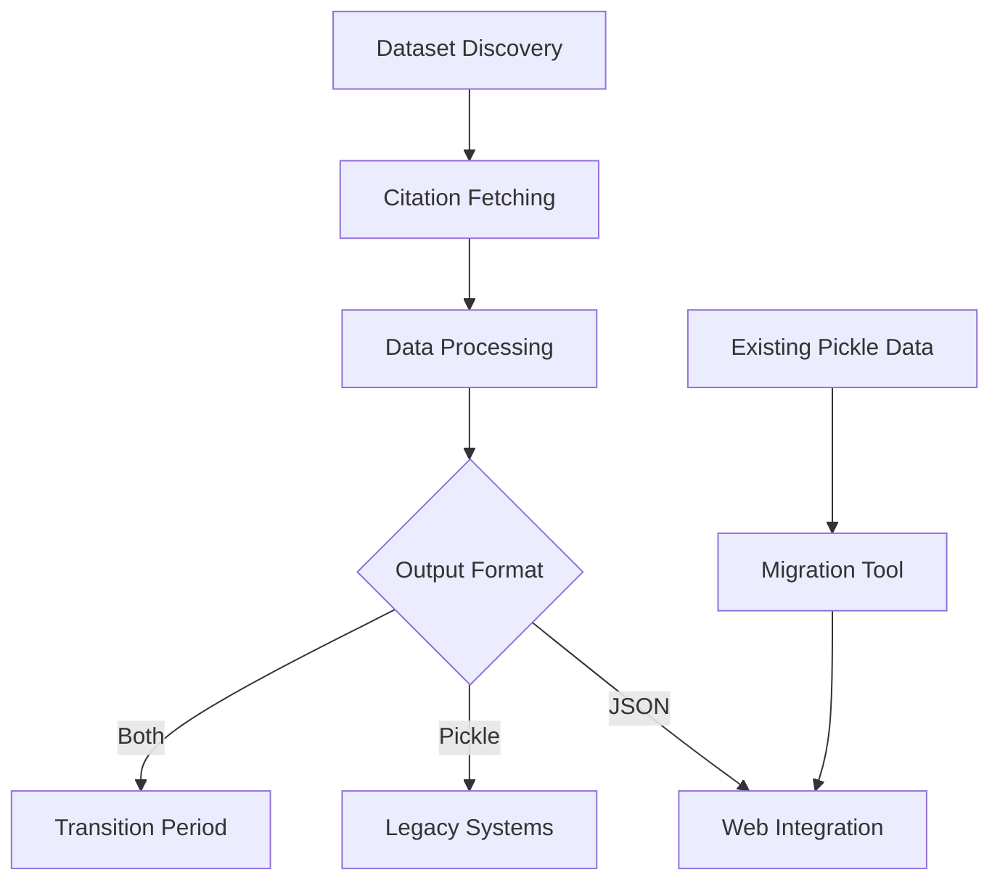

# Dataset Citations

[](https://www.python.org/downloads/)
[](#license)
[](https://github.com/neuromechanist/dataset_citations)

Automated BIDS dataset citation tracking and JSON generation system for scientific research datasets.

## Overview

This system automatically discovers, tracks, and manages citations for BIDS (Brain Imaging Data Structure) datasets. It provides a complete workflow from dataset discovery to citation tracking with web-friendly JSON output format.

### Key Features

- 🔍 **Automated Dataset Discovery**: Finds relevant BIDS datasets using configurable search patterns
- 📊 **Citation Tracking**: Fetches and tracks citation counts and detailed citation information from Google Scholar
- 🌐 **Web-Ready Output**: Generates clean JSON files perfect for website integration
- 🔄 **Format Migration**: Converts legacy pickle files to modern JSON format
- 🚀 **CI/CD Integration**: GitHub Actions workflow for automated updates
- 📈 **Trend Analysis**: Track citation trends over time, (look for sample scripts)

## Installation

### Requirements

- Python 3.8 or higher
- Active internet connection for citation fetching
- ScraperAPI key (for Google Scholar access)

### Install from Source

```bash
git clone https://github.com/neuromechanist/dataset_citations.git
cd dataset_citations
pip install -e .
```

### Dependencies

The package automatically installs these core dependencies:
- `pandas>=1.3.0` - Data manipulation and analysis
- `scholarly>=1.7.0` - Google Scholar API interaction
- `requests>=2.25.0` - HTTP requests
- `beautifulsoup4>=4.9.0` - HTML parsing
- `free-proxy>=1.1.0` - Proxy management
- `python-dotenv>=0.19.0` - Environment variable management

## Quick Start

### 1. Environment Setup

Create a `.env` file in the project root:

```bash
SCRAPERAPI_KEY=your_scraperapi_key_here
```

### 2. Basic Usage

```bash
# Discover relevant datasets
python discover_datasets.py --output-file discovered_datasets.txt

# Update citations for discovered datasets
python update_citations.py \
    --dataset-list-file discovered_datasets.txt \
    --previous-citations-file citations/previous_citations.csv \
    --output-dir citations/ \
    --output-format both

# Migrate existing pickle files to JSON
python migrate_pickle_to_json.py
```

### 3. Using as Python Package

```python
import citation_utils

# Convert pickle to JSON
json_path = citation_utils.migrate_pickle_to_json(
    'citations/pickle/ds002718.pkl', 
    'citations/json', 
    'ds002718'
)

# Load citation data
citations = citation_utils.load_citation_json(json_path)
print(f"Dataset {citations['dataset_id']} has {citations['num_citations']} citations")
```

## Project Structure

```
dataset_citations/
├── citations/                  # Citation data storage
│   ├── json/                  # JSON format citations (302 files)
│   ├── pickle/                # Legacy pickle format (302 files, will develop further) 
│   └── *.csv                  # Summary and tracking files
├── scripts/                   # Utility scripts
├── tasks/                     # Task management
├── tests/                     # Test suite
├── .github/workflows/         # CI/CD automation
├── citation_utils.py          # Core citation handling utilities
├── update_citations.py        # Main citation update script
├── migrate_pickle_to_json.py  # Migration utility
├── discover_datasets.py       # Dataset discovery
├── pyproject.toml            # Package configuration
└── README.md                 # This file
```

## Usage Guide

### Command Line Interface

#### Update Citations

```bash
python update_citations.py \
    --dataset-list-file datasets.txt \
    --previous-citations-file citations/previous_citations.csv \
    --output-dir citations/ \
    --output-format json \
    --workers 5
```

**Options:**
- `--output-format`: Choose `pickle`, `json`, or `both`
- `--workers`: Number of parallel workers (default: 5)
- `--no-update-num-cites`: Skip citation count updates

#### Migrate Data

```bash
python migrate_pickle_to_json.py \
    --input-dir citations/pickle/ \
    --output-dir citations/json/ \
    --overwrite
```

#### Discover Datasets

```bash
python discover_datasets.py \
    --output-file discovered_datasets.txt \
    --search-terms "fMRI,EEG,MEG" \
    --limit 100
```

### JSON Output Format

Each dataset gets a `{dataset-id}_citations.json` file:

```json
{
  "dataset_id": "ds002718",
  "num_citations": 13,
  "date_last_updated": "2024-07-24T22:07:39.909557+00:00",
  "metadata": {
    "total_cumulative_citations": 135,
    "fetch_date": "2024-07-24T22:07:39.909557+00:00",
    "processing_version": "1.0"
  },
  "citation_details": [
    {
      "title": "From BIDS-formatted EEG data to sensor-space group results",
      "author": "CR Pernet, R Martinez-Cancino, D Truong",
      "venue": "Frontiers in neuroscience",
      "year": 2021,
      "url": "https://www.frontiersin.org/articles/10.3389/fnins.2020.610388/full",
      "cited_by": 46,
      "abstract": "This paper investigates brain network connectivity...",
      "publisher": "Frontiers Media SA",
      "volume": "14",
      "pages": "610388"
    }
  ]
}
```

### GitHub Actions Workflow

The project includes automated CI/CD via GitHub Actions (`.github/workflows/update_citations.yml`):

- Automatically discovers new datasets
- Updates citation counts and detailed information
- Migrates data to JSON format
- Creates pull requests with changes
- Runs monthly or on manual trigger

## Development

### Local Development Setup

1. **Clone and install:**
   ```bash
   git clone https://github.com/neuromechanist/dataset_citations.git
   cd dataset_citations
   pip install -e ".[dev]"
   ```

2. **Set up environment:**
   ```bash
   cp .env.example .env
   # Edit .env with your API keys
   ```

3. **Run tests:**
   ```bash
   pytest tests/ -v
   ```

### Development Tools

The project uses modern Python development tools:

- **Black**: Code formatting
- **isort**: Import sorting  
- **mypy**: Type checking
- **pytest**: Testing framework
- **pre-commit**: Git hooks

```bash
# Format code
black .

# Type check
mypy .

# Run tests with coverage
pytest --cov=dataset_citations tests/
```

## Architecture

### Core Components

1. **Dataset Discovery** (`discover_datasets.py`)
   - Searches for BIDS datasets using configurable patterns
   - Outputs dataset lists for processing

2. **Citation Fetching** (`getCitations.py`)
   - Interfaces with Google Scholar via scholarly library
   - Handles proxy management and rate limiting
   - Extracts detailed citation information

3. **Data Processing** (`update_citations.py`)
   - Orchestrates the citation update workflow
   - Manages parallel processing of multiple datasets
   - Handles both citation counts and detailed information

4. **Format Conversion** (`citation_utils.py`)
   - Converts between pickle and JSON formats
   - Provides data validation and error handling
   - Creates web-friendly structured output

5. **Migration Tools** (`migrate_pickle_to_json.py`)
   - Bulk conversion of existing data
   - Validation and reporting
   - Handles edge cases and data quality issues

### Data Flow



## API Reference

### Core Functions

#### `citation_utils.py`

```python
def save_citation_json(dataset_id: str, citations_df: pd.DataFrame, 
                      output_dir: str, fetch_date: Optional[datetime] = None) -> str:
    """Save citation data as JSON file."""

def load_citation_json(filepath: str) -> Dict[str, Any]:
    """Load citation data from JSON file."""

def migrate_pickle_to_json(pickle_filepath: str, output_dir: str, 
                          dataset_id: Optional[str] = None) -> str:
    """Convert pickle file to JSON format."""
```

### Command Line Scripts

All scripts support `--help` for detailed usage information:

```bash
python update_citations.py --help
python migrate_pickle_to_json.py --help
python discover_datasets.py --help
```

## Configuration

### Environment Variables

Create a `.env` file:

```bash
# Required
SCRAPERAPI_KEY=your_scraperapi_key_here

# Optional
GITHUB_TOKEN=your_github_token_for_actions
ANTHROPIC_API_KEY=your_anthropic_key
PERPLEXITY_API_KEY=your_perplexity_key
```

### Configuration Files

- `pyproject.toml`: Package configuration and dependencies
- `.github/workflows/update_citations.yml`: CI/CD pipeline
- `requirements.txt`: Legacy dependency file

## Troubleshooting

### Common Issues

1. **ScraperAPI Key Not Found**
   ```bash
   ERROR: SCRAPERAPI_KEY environment variable not set
   ```
   **Solution**: Add your ScraperAPI key to `.env` file

2. **Google Scholar Rate Limiting**
   ```bash
   Got a captcha request
   ```
   **Solution**: The system uses proxy rotation; wait and retry

3. **Pickle Migration Failures**
   ```bash
   The truth value of an array with more than one element is ambiguous
   ```
   **Solution**: This is handled automatically in v1.0.0+

### Debug Mode

Enable verbose logging:

```bash
python update_citations.py --verbose --workers 1
```

### Support

- **Issues**: [GitHub Issues](https://github.com/neuromechanist/dataset_citations/issues)
- **Discussions**: [GitHub Discussions](https://github.com/neuromechanist/dataset_citations/discussions)
- **Email**: shirazi@ieee.org

## Contributing

We welcome contributions! Please see our contributing guidelines:

1. Fork the repository
2. Create a feature branch
3. Make your changes
4. Add tests for new functionality
5. Run the test suite
6. Submit a pull request

### Development Guidelines

- Follow PEP 8 style guidelines
- Add type hints to new functions
- Include docstrings for public APIs
- Update tests for any changes
- Update documentation as needed

## License

**Copyright (c) 2025 Seyed Yahya Shirazi (neuromechanist)**  
All rights reserved.

This software is proprietary and confidential. Unauthorized copying, distribution, or use is strictly prohibited.

## Citation

If you use this software in your research, please cite:

```bibtex
@software{shirazi2024datasetcitations,
  title={Dataset Citations: Automated BIDS Dataset Citation Tracking System},
  author={Shirazi, Seyed Yahya},
  year={2025},
  url={https://github.com/neuromechanist/dataset_citations}
}
```

## Acknowledgments

- **Author**: [Seyed Yahya Shirazi](https://github.com/neuromechanist)
- **GitHub**: [@neuromechanist](https://github.com/neuromechanist)

Built with ❤️ for the neuroscience open science.

---

*Last updated: July 24, 2025*
